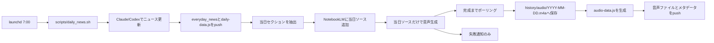

# ai_news_daily NotebookLM音声連携 設計書

作成日: 2026-08-28

## 目的

毎朝更新している `ai_news` の日次ニュースをNotebookLMで日本語の音声解説に変換し、`ai_news_daily`（`history/daily.html`）から日付ごとに再生できるようにする。

ユーザーがニュースカードを読むだけでなく、移動中や作業中にも、その日に抽出された記事全体の内容を音声でインプットできる状態を作る。

## 背景

- ニュース本文は `everyday_news/<YYYYMM>.md` に日付セクション単位で保存される。
- `scripts/generate_daily_data.py` が全月のMarkdownを読み込み、`history/daily-data.js`（`window.DAILY_NEWS`）を再生成する。
- `history/daily.html` は完全な静的ページで、カレンダー選択時に `window.DAILY_NEWS` の記事カードを描画する。
- 毎朝の処理は `scripts/daily_news.sh` が `launchd` から起動し、ニュース更新・サイトデータ生成・GitHub pushまでを行う。
- この環境には `nlm` CLI（NotebookLM MCP CLI）が導入済みで、ソース追加、Audio Overview生成、生成完了待機、音声ファイルのダウンロードをシェルから実行できる。

NotebookLMの公式ヘルプでは、音声解説はソースに基づくポッドキャスト形式で生成でき、日本語を含む複数言語に対応し、生成後の音声をダウンロードできるとされている。[公式ヘルプ](https://support.google.com/gemininotebook/answer/16212820?hl=ja)

## 設計方針

### 1. NotebookLM専用ノートを使う

既存の「2026年日記」ノートは使用せず、「AIニュース音声」専用のNotebookLMノートを1つ用意する。

専用ノートには、当日分のニュースソースだけを登録する。日記や別テーマのソースと混ざらないため、音声がAIニュース以外の内容を拾うことを防ぐ。

### 2. ソースは当日分だけ差し替える

毎朝、`everyday_news/<YYYYMM>.md` から実行日と一致する `## YYYY-MM-DD` セクションを取り出し、当日専用のMarkdownソースとしてNotebookLMへ追加する。

ソースタイトルには `AIニュース日次: YYYY-MM-DD` のような固定プレフィックスを付ける。音声生成に成功した後、同じプレフィックスを持つ過去のソースだけを削除する。他のソースは削除しない。

音声生成前に過去ソースを削除しないことで、生成失敗時にも前回の状態を残し、再試行しやすくする。

### 3. 音声ファイルはサイトに同梱する

NotebookLMからダウンロードした `.m4a` ファイルをGit管理下の `history/audio/` に保存する。

NotebookLM CLIの出力形式が `.m4a` のため、MP3への変換は行わない。ブラウザの標準Audio要素で再生でき、追加の音声変換依存も不要になる。

### 4. 音声処理はニュース更新の後段で独立させる

ニュース本文の更新と音声生成を同じ成功条件にしない。ニュース更新が成功した後に音声生成を実行し、音声生成が失敗してもニュース本文・日次データ・LINE通知は成功扱いにする。

## 処理フロー



### ニュース更新後の詳細

1. `daily_news.sh` が既存どおりニュース更新処理を実行する。
2. ニュース更新が終了コード0の場合だけ、音声生成スクリプトを呼び出す。
3. 音声生成スクリプトが当日セクションの存在を確認する。
4. `everyday_news/.daily_audio_source.md` を上書き生成する。このファイルはGit管理外とする。
5. `nlm source add` によって専用ノートへ当日ソースを追加し、処理完了まで待つ。
6. 追加したソースIDを解決し、`nlm create audio` に `--source-ids` で明示的に渡す。
7. 日本語・詳細形式・標準長でAudio Overviewを生成する。
8. `nlm status artifacts` 等で完成状態を確認し、タイムアウトまで一定間隔で再試行する。
9. 完成後、音声を `history/audio/YYYY-MM-DD.m4a` にダウンロードする。
10. `history/audio-data.js` を音声ファイル一覧から再生成する。
11. 当日音声と音声メタデータをコミットし、`main`へpushする。
12. 音声生成に成功した後、旧日次ソースを削除する。

### 冪等性

- 当日の音声ファイルと音声メタデータが既に存在し、対象のGit差分も無い場合、通常実行では再生成しない。
- 音声ファイルが存在していても未コミット・未pushの対象差分があれば、音声生成をやり直さず、その差分のコミット・pushを再試行する。
- 同じ日付のニュース更新を再実行しても、音声ファイルを二重登録しない。
- `--force` 相当の明示的な再生成手段は、必要になった場合に追加する。初期実装では自動再生成を優先しない。

## データ形式

既存の `history/daily-data.js` は変更せず、音声情報を別ファイルに分離する。

```js
window.DAILY_AUDIO = {
  "2026-08-28": {
    "src": "audio/2026-08-28.m4a",
    "label": "2026-08-28のAIニュース音声",
    "title": "NotebookLMが生成した音声タイトル"
  }
};
```

`audio-data.js` は `history/audio/` に存在する音声ファイルだけを対象に生成する。NotebookLMの生成結果から取得したタイトルは `history/audio-titles.json` で日付と対応付ける。タイトルが取得できない場合は日付ベースのフォールバックを使い、音声が無い日付はデータに含めない。

## ページ側の変更

`history/daily.html` に `audio-data.js` を読み込ませ、`renderDay()` の日付見出し付近に音声プレイヤーを追加する。

- `DAILY_AUDIO[selected]` がある場合だけ音声UIを表示する。
- HTML標準の `<audio controls preload="metadata">` を使う。
- NotebookLMが生成した音声タイトルをプレイヤーの見出しとアクセシビリティ名に表示する。
- タイトルが無い古いメタデータでは、日付ベースのフォールバックを表示する。
- 日付を切り替えたら、選択中の日付の音声に差し替える。
- 自動再生は行わない。
- 音声URLは生成済みの相対パスだけを許可する。
- 再生エラー時は、プレイヤー付近に「音声を再生できません」と表示する。
- モバイル幅ではプレイヤーがカードや画面からはみ出さないよう、`max-width: 100%` と `min-width: 0` を適用する。

## エラー処理

### 音声処理を開始できない場合

- `nlm` CLIが見つからない
- NotebookLM設定ファイルが無い
- 当日セクションが見つからない
- 認証が切れている

上記の場合は音声処理を終了し、`daily_news.sh` はニュース更新の成功状態を維持する。ログには原因を出力し、macOS通知で音声未生成を知らせる。

### NotebookLM側で失敗する場合

- ソース追加失敗
- 音声生成失敗
- 音声生成がタイムアウト
- ダウンロード失敗

途中まで作られた音声ファイルは、完成ファイルとして扱わない。対象ファイルは一時名で保存し、ダウンロードが成功した後に本来のファイル名へ移す。音声生成が失敗した場合は既存の過去音声と既存の `audio-data.js` を変更しない。

### Git push失敗

音声ファイルをローカルに保持したままエラー終了し、次回の自動処理で未pushの対象差分を検出してコミット・pushを再試行できるようにする。既存のニュース更新結果を巻き戻さない。

## 成果物

| 種別 | ファイル | 役割 |
|---|---|---|
| 追加 | `scripts/generate_notebooklm_audio.sh` | 当日ソースの抽出、NotebookLM操作、音声保存、pushを統括 |
| 追加 | `scripts/generate_audio_data.py` | `history/audio/` から `audio-data.js` を再生成 |
| 変更 | `scripts/daily_news.sh` | ニュース更新成功後に音声処理を呼び出し、音声失敗を分離 |
| 変更 | `history/daily.html` | 音声データの読み込みと日付ごとのプレイヤー表示 |
| 追加 | `history/audio-data.js` | 日付と音声ファイルの対応データ |
| 追加 | `history/audio-titles.json` | NotebookLMが生成した日付別音声タイトル |
| 追加 | `history/audio/*.m4a` | NotebookLMから取得した日次音声 |
| 変更 | `.gitignore` | `everyday_news/.daily_audio_source.md` 等の一時設定を除外 |
| 追加 | `scripts/notebooklm_audio.env.example` | NotebookLM専用ノートID設定の雛形 |
| 変更 | `README.md` | 初回NotebookLM設定と手動再試行方法を記載 |
| 追加 | `test/test_generate_audio_data.py` | 音声メタデータ生成のテスト |

## 初回セットアップ

実装後に一度だけ、次を行う。

1. `nlm create notebook "AIニュース音声"` で専用ノートを作成する。
2. NotebookLM CLIの認証状態を確認する。未認証の場合は `nlm login` を実行する。
3. `scripts/notebooklm_audio.env.example` を `scripts/notebooklm_audio.env` にコピーし、ノートIDを設定する。この設定ファイルはGit管理外とする。
4. 手動で音声生成スクリプトを実行し、NotebookLMの音声生成からサイトへの保存までを確認する。
5. `history/daily.html` の最新日付で再生できることを確認する。

NotebookLMの認証情報はリポジトリへ保存しない。CLIが管理するローカルの認証プロファイルを使用する。

## スコープ外

- NotebookLMの共有リンクをページに埋め込む方式
- NotebookLM以外の音声合成サービスへのフォールバック
- 既存の日記ノートの変更
- 2026年7月・8月など過去日付の音声の一括バックフィル
- ニュースMarkdownの既存フォーマット変更
- 音声の文字起こしや記事カードとの同期再生
- 音声ファイルを外部オブジェクトストレージへ移すこと

## 注意点

- `nlm` CLIはGoogle公式APIではなく、現行のNotebookLM動作に依存するローカルCLIである。CLIやNotebookLMの仕様変更で処理が失敗する可能性があるため、音声処理は常にニュース更新から独立して失敗できるようにする。
- NotebookLMの音声生成は数分かかる場合がある。launchdのタイムアウトを避けるため、生成待ち時間とログ出力を明示する。
- `.m4a`を毎日Git管理するため、音声の保存期間が長くなるとリポジトリ容量が増える。初期実装では過去音声を残すが、容量を監視し、必要になった時点で外部ストレージや保存期間を再検討する。

## 検証

1. 当日セクション抽出の単体テストを追加し、別日付の内容を混入させないことを確認する。
2. `generate_audio_data.py` が `.m4a` のみを対象にし、日付順で安全な相対URLを出力することを確認する。
3. `daily_news.sh` の音声失敗時に、ニュース更新の終了コードと既存データが維持されることを確認する。
4. NotebookLM専用ノートへ当日ソースだけが追加されることを確認する。
5. 音声生成完了後に `.m4a` と `audio-data.js` が作られ、旧日次ソースだけが整理されることを確認する。
6. ローカルの `history/daily.html` で、音声がある日と無い日を切り替え、プレイヤー表示が正しく切り替わることを確認する。
7. 375px程度のスマホ幅でプレイヤーが横にはみ出さないことを確認する。
8. Vercel公開後の `ai_news_daily` で、最新日と過去日の音声を実際に再生できることを確認する。
